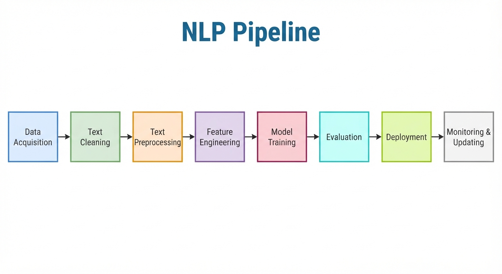

# Natural Language Processing (NLP) - My learning path

A practical and hands-on journey into **Natural Language Processing (NLP)** with Python.

This repository contains my notes, exercises, notebooks, and small projects as I learn NLP step by step.

## Overview

All docs all available in [doc](./docs/)

This learning path follows the main stages of the NLP pipeline: data acquisition, text cleaning, text preprocessing, feature engineering, modeling, evaluation, deployment, and monitoring. The goal is to understand each step conceptually and to apply these techniques in end-to-end NLP projects.

--- 

## NLP Pipeline and Learning Path

This section connects the general NLP workflow to the topics covered in this repository.

### Step 1: Data Acquisition

Data acquisition is the process of collecting the raw text data needed for an NLP project. This data may come from datasets, web sources, APIs, documents, or user-generated content. The quality and relevance of the collected data strongly influence the performance of the final model.

### Step 2: Text Cleaning

Text cleaning focuses on removing noise and inconsistencies from raw text, such as extra spaces, punctuation, HTML tags, irrelevant symbols, and inconsistent casing. This step helps standardize the text before further analysis.

### Step 3: Text Preprocessing

> see notebooks (tutorials/examples) from [00_regex](/00_regex/) ... [04_NER](/04_NER/)

Text preprocessing transforms text into a format that is easier to analyze and model. Common techniques include:

* Regular Expressions
* Tokenization
* Stemming & Lemmatization
* Named Entity Recognition

### Step 4: Feature Engineering

> see notebooks (tutorials/examples) from  ... 

Feature engineering converts text into numerical representations (vectors) that machine learning models can understand. Common methods include:

* Bag of Words
* TF-IDF (TERM FREQUENCY/ INVERSE DOC FREQUENCY)
* Word Embeddings

### Step 5: Model Selection and Training

This stage involves choosing an appropriate NLP model, such as classical machine learning algorithms or modern deep learning and transformer-based architectures, and training it on the processed data.

### Step 6: Evaluation

Evaluation measures how well the model performs using appropriate metrics and validation strategies. This step helps assess accuracy, robustness, and generalization before deployment.

### Step 7: Deployment, updating and Monitoring

Once a model is trained and evaluated, it can be deployed in real-world applications. Continuous monitoring is important to track performance, detect drift, and update the system as new data becomes available.

---

# Tools and Libraries Used in This Project

* Python
* NumPy
* Pandas
* NLTK
* spaCy
* Scikit-learn
* Hugging Face

---